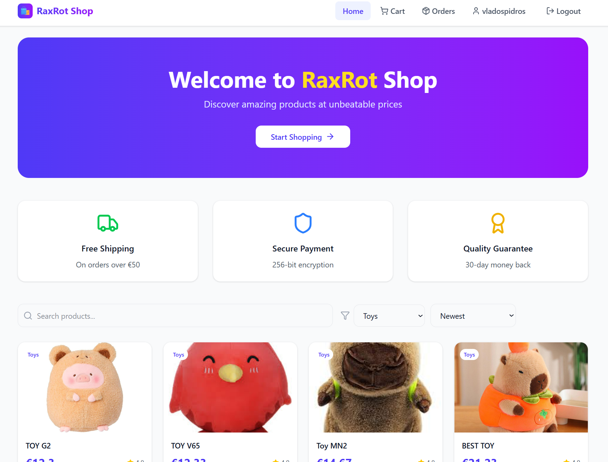
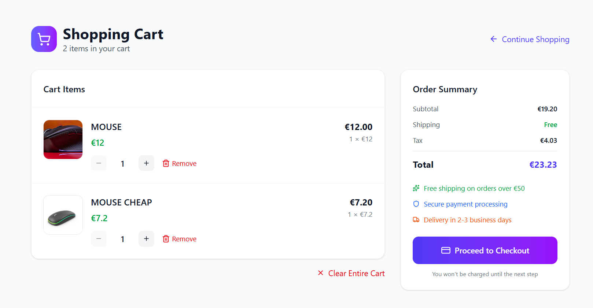
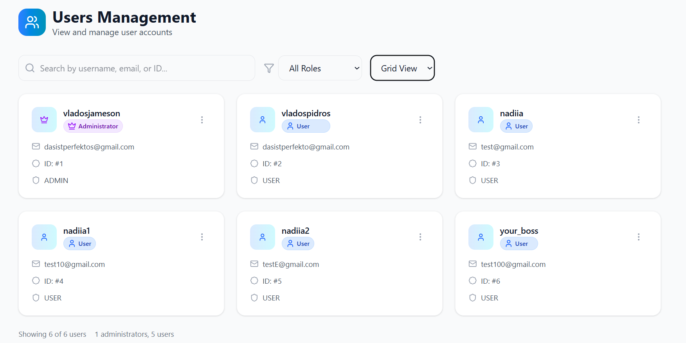
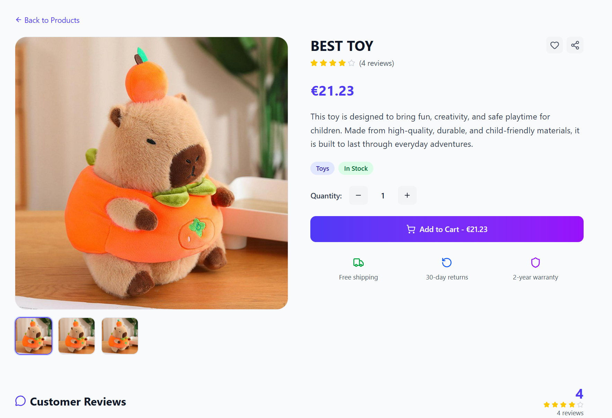
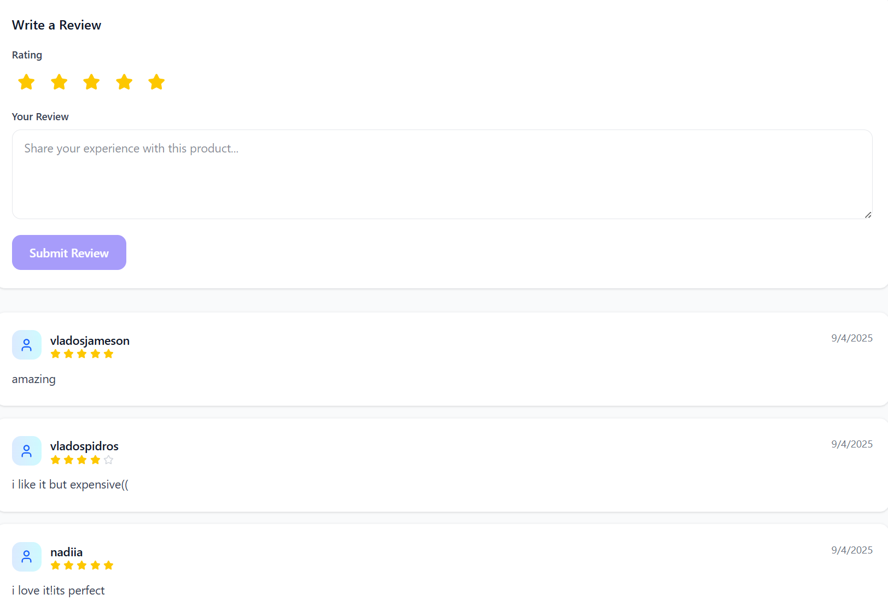
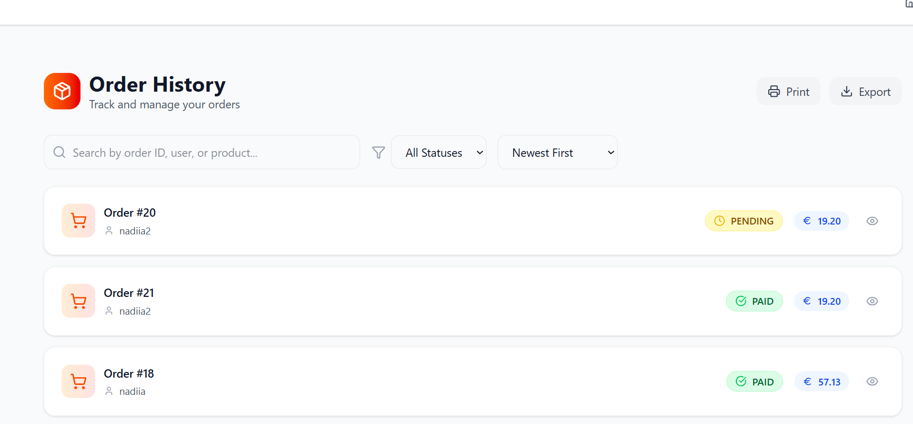
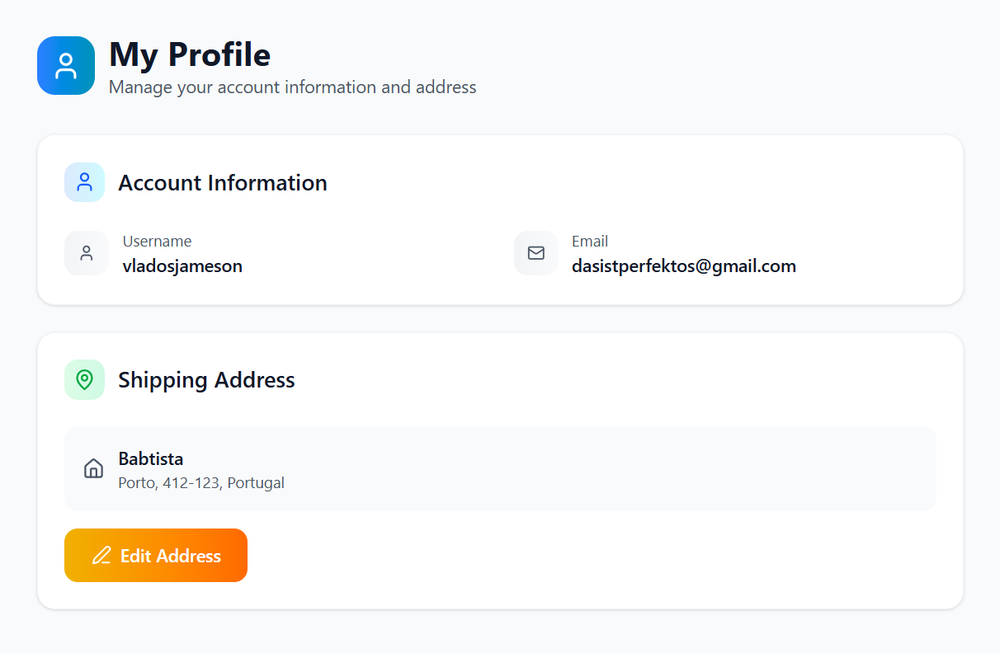

# 🛒 RaxRot E-Commerce Platform

A **production-style online store** built with **Spring Boot** and **React + Tailwind**.  
More than just CRUD — this project demonstrates how **real-world e-commerce systems** are designed.

---

## 📸 Screenshots

### 🏠 Main Page

### 🛒 Shopping Cart

### 👥 User Management (Admin)

### 📖 Product Details

### ⭐ Product Review

### 📦 Order History

### 🙍 My Profile

---

## ✨ Features

### 🔐 Authentication & Security
- JWT-based authentication with secure HTTP-only cookies
- Role-based access control: `USER` & `ADMIN`
- Full Spring Security integration

### 👤 User Features
- Register, login, logout
- Manage profile & shipping address
- Browse products by category, search by name
- Add products to cart, update quantity, clear cart
- Leave reviews & ratings on products
- Place & confirm orders with real payments

### 🛍️ Shopping & Orders
- Smart cart management with automatic total calculation
- Stripe integration for secure online payments 💳
- Order confirmation only after successful payment
- Track personal order history

### 📦 Product & Category Management
- Product CRUD with **image uploads to AWS S3**
- Category CRUD with validation & uniqueness checks
- Stock automatically updated after orders
- Real-time review statistics: ⭐ average rating & review count

### 💬 Reviews & Comments
- Users can create, update, and delete their own reviews
- Admins can moderate and delete any review
- Pagination & sorting for reviews

### 📧 Email Notifications
- Automatic **welcome email** on registration
- Centralized email service with JavaMailSender

### ⚙️ Admin Features
- Manage users, roles, categories, products, orders, and comments
- Advanced search with pagination, filtering, and sorting

### 🎨 Frontend Features
- Built with **React (Vite)** and **TailwindCSS**
- Form validation with **React Hook Form + Zod**
- Global state management with **Zustand**
- Responsive design with modern UI components (shadcn/ui)
- Dynamic Navbar with user info & cart counter
- Product details with ratings, reviews, and Add-to-Cart
- Profile page with address management
- Admin dashboard with tabs for Users, Products, Categories, and Orders

### 🚨 Error Handling
- Global exception handling returning consistent JSON responses
- Field-level validation with detailed error messages

---

## 🧭 Typical User Journey
1. Register or login as a user
2. Browse products by category or search
3. Add items to the cart and adjust quantities
4. Proceed to checkout and pay via Stripe
5. Confirm the order and view it in **My Orders**
6. Leave a review for purchased products

---

## 🏗️ Tech Highlights
- **Backend:** Spring Boot, Spring Security, Spring Data JPA, ModelMapper
- **Database:** JPA/Hibernate with SQL
- **Payments:** Stripe API integration
- **File Storage:** AWS S3 for product images
- **Email:** JavaMailSender for notifications
- **Frontend:** React (Vite) + TailwindCSS + Zustand + shadcn/ui

---

## 🔮 Future Improvements
- Deploy backend to AWS / Render / Railway
- Deploy frontend to Vercel / Netlify
- Add JWT refresh tokens
- Add unit & integration tests
- Add product recommendations (ML/AI-ready)

---

💡 This is far above a "junior CRUD project" — it demonstrates the skill set of a **strong junior moving into mid-level** developer.  
